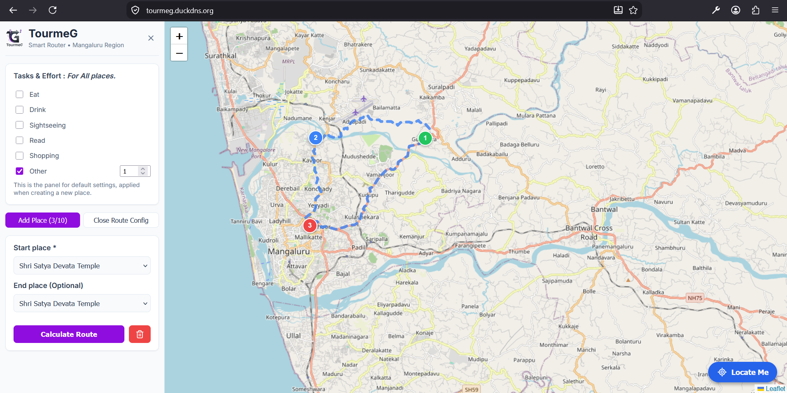

<h1 align="center"> TourmeG: Dynamic Map-Based Route Planner</h1>

**TourmeG** is a professional, user-centric shortest-path planner designed for navigating tourist spots in Mangaluru. Unlike standard navigation tools, it combines real-world road network data with a custom **"Node Effort"** system, helping users plan efficient routes based on distance and the workload (tasks and time) at each destination.


## Key Features

* **Interactive Leaflet Map**: Add up to 10 custom nodes by clicking within a restricted Mangaluru boundary.
* **Hybrid Path Optimization**: Combines **TSP (Traveling Salesperson Problem)** for visit order and **A*** for road-level accuracy.
* **Dynamic Effort Scoring**: Assign tasks (e.g., Eating, Sightseeing) to locations. The route recalculates based on a "Workload Weight" that balances travel distance with task effort.
* **Global vs. Local Configuration**: A reactive sidebar sets default tasks globally, while per-node modals allow for specific overrides.
* **OSM Road Snapping**: Automatically "snaps" user-clicked points to the nearest real road node from OpenStreetMap (OSM) data to ensure valid routing.
* **Nominatim Location Search**: A built-in search engine powered by OpenStreetMap to instantly find and fly to any address or landmark globally.
* **Interactive Navigation Drawer**: A responsive bottom-sheet UI that provides turn-by-turn guidance and dynamically tracks GPS progression.
* **Multi-Layer Theme Engine**: Swap between Standard, Minimal, Satellite, and a high-contrast Semantic Dark Mode seamlessly, with preferences saved locally.
* **Installable PWA**: TourmeG is configured as a fully installable Progressive Web App (PWA) offering a native mobile experience and flawless viewport scaling on all devices.
* **Backend Path Caching**: The Java backend caches A* results to minimize redundant computations across the distance matrix.


## Tech Stack

| Layer | Technologies |
| --- | --- |
| **Frontend** | React, Vite, Leaflet, Sonner (Toasts) |
| **Backend** | Spring Boot (Java), Overpass API (OSM Data), Jackson (JSON Parsing) |
| **Algorithms** | A* Search, TSP (Nearest Neighbor + 2-opt), Haversine Formula |
| **Storage** | Browser LocalStorage (session persistence) |


## Algorithmic Workflow

### 1. Data Pre-computation

The backend builds a "Master Graph" at startup by parsing an OSM JSON file of Mangaluru. It maps road segments into an adjacency list for high-speed lookup.

### 2. The Hybrid Cost Function

The cost for every potential edge between nodes is calculated as:


The `workloadWeight` ensures that a "typical" task effort is mathematically comparable to travel distance.

### 3. Execution Sequence

1. **Snapping**: Map coordinates are translated to the nearest road network node IDs.
2. **Distance Matrix**: The backend runs A* between all pairs of selected nodes.
3. **TSP Optimization**: The solver determines the optimal visiting order (Fixed Start, Optional End).
4. **Path Stitching**: Stored A* paths are stitched together and sent to the frontend as a polyline.


## Project Structure

### Backend (`com.graph.TourmeG`)

Based on the project structure, the backend is organized into specialized services:

* **`controller`**: Contains `RouteController` to handle API requests from the frontend.
* **`service`**:
* `GraphService`: Manages the OSM road network graph.
* `MatrixService`: Computes the distance matrix between all selected points.
* `TSPService`: Solves the visiting order optimization.


* **`dto`**: Data Transfer Objects like `TspRequest` and `StopDTO` for structured API communication.
* **`model`**: Core definitions for `Node` and `Edge` objects.

### Frontend

* **`components/`**: UI elements like `MapView` and `Configuration`.
* **`context/`**: Manages global state for nodes and default settings.
* **`utils/`**: Helper functions for workload calculation and coordinate validation.


## Installation & Setup


### Prerequisites

* Node.js (v18+)
* JDK 17+
* Maven

### 1. Backend Setup

1. Navigate to the backend folder.
2. Ensure your OSM data file is in `src/main/resources`.
3. Run with Maven: `mvn spring-boot:run`.

### 2. Frontend Setup

1. Navigate to the `frontend` folder.
2. Create a `.env` file and add:
```env
VITE_SERVER_URL=http://localhost:8080

```
3. Install dependencies and start the dev server:
```bash
npm install
npm run dev
```

## Screenshot


### Small notes:

* **NP-Hard Constraints:** To maintain performance, the application currently limits planning to 10-15 nodes.
* **Offline First:** Transitioned from live Overpass API queries to a local "Master Graph" for faster snapping and offline reliability.

> **TourmeG** — *Smart planning for a better travel experience in Mangaluru.*
> All rights are reserved - Abheeshta P
